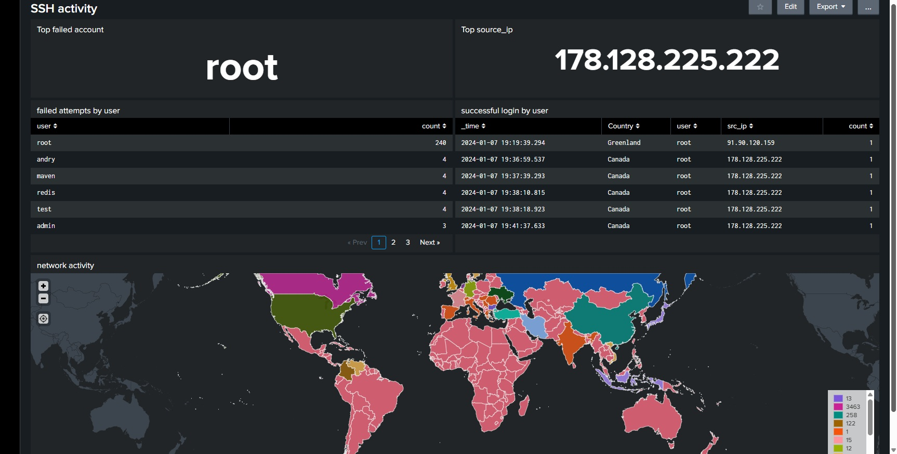
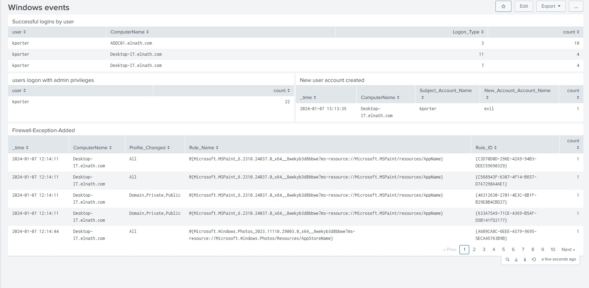

# Splunk SOC Dashboards

Two Splunk dashboards built to monitor and investigate security events: SSH brute-force activity against a Linux host, and Windows security events on a small AD-joined environment. Includes a real detection finding from the Windows dashboard.

> Built while following [MyDFIR's](https://www.youtube.com/@MyDFIR) Splunk SOC lab series by Steven Mah, using the course-provided sample dataset. Dashboards, SPL queries, and the investigation write-up below are my own work built on top of that environment.

## Dashboards Overview


Three dashboards are maintained in this Splunk app: **SSH activity**, **ssh2**, and **Windows events**.

---

## SSH Activity Dashboard



This dashboard tracks SSH authentication attempts against a Linux host, surfacing:

- **Top failed account** — `root`, by a wide margin (240 failed attempts), consistent with automated brute-force scanning rather than a targeted attack on a specific user.
- **Top source IP** — `178.128.225.222`, responsible for repeated successful `root` logins in short succession.
- **Failed attempts by user** — a spread across common default usernames (`root`, `andry`, `maven`, `redis`, `test`, `admin`), a classic signature of credential-stuffing/dictionary-based SSH scanning.
- **Successful logins by user** — multiple successful `root` logins from the same source IP within minutes of each other, geolocated to Canada.
- **Network activity map** — visualizes SSH connection attempts by country, showing this host is being probed from a wide geographic spread, not a single origin.

### Key SPL queries

```spl
# Top failed account
index=ssh sourcetype=linux_secure "Failed password"
| rex field=_raw "Failed password for (invalid user )?(?<user>\w+)"
| top limit=1 user

# Failed attempts by user
index=ssh sourcetype=linux_secure "Failed password"
| rex field=_raw "Failed password for (invalid user )?(?<user>\w+)"
| stats count by user
| sort -count

# Successful logins by user (with geolocation)
index=ssh sourcetype=linux_secure "Accepted password"
| rex field=_raw "Accepted password for (?<user>\w+) from (?<src_ip>[\d\.]+)"
| iplocation src_ip
| table _time Country user src_ip

# Network activity map
index=ssh sourcetype=linux_secure "Failed password"
| rex field=_raw "from (?<src_ip>[\d\.]+)"
| iplocation src_ip
| geostats count by Country
```

**Investigation takeaway:** the combination of a dominant failed-login username (`root`), a single IP achieving repeated successful logins, and a global spread of probing traffic is consistent with internet-facing SSH brute-force activity. This dashboard would drive a real SOC decision to disable direct root SSH login, enforce key-based auth, and consider IP-based rate limiting or blocking on `178.128.225.222`.

---

## Windows Events Dashboard



This dashboard monitors authentication and account activity across a small Windows/AD environment (`elnath.com` domain), tracking:

- **Successful logins by user** — baseline of normal authentication activity by host and logon type (Event ID 4624).
- **Users logon with admin privileges** — tracks which accounts are authenticating with elevated rights (Event ID 4672).
- **New user account created** — an automated detection surfacing any new account creation event (Event ID 4720).
- **Firewall-Exception-Added** — tracks changes to the Windows Firewall allow-list (Event ID 2004), which can indicate either legitimate application installs or an attacker opening a path for follow-on access.

### Key SPL queries

```spl
# Successful logins by user
index=wineventlog EventCode=4624
| stats count by user ComputerName Logon_Type

# Users logon with admin privileges
index=wineventlog EventCode=4672
| stats count by user

# New user account created
index=wineventlog EventCode=4720
| table _time ComputerName Subject_Account_Name New_Account_Account_Name

# Firewall exception added
index=wineventlog EventCode=2004
| table _time ComputerName Profile_Changed Rule_Name Rule_ID
```

### Finding: suspicious account creation by a privileged user

The **New user account created** panel flagged a genuinely notable event: the account `kporter` — who also shows 22 separate admin-privileged logons on `Desktop-IT.elnath.com` — created a new local account named **`evil`** on `2024-01-07 13:13:35`.

This is a strong indicator of either:
- A compromised admin credential being used to establish a persistence account, or
- Insider misuse of legitimate admin access.

An account name like `evil` is an unusually blunt signal in a real environment (most attackers choose an inconspicuous name to blend in), but it demonstrates the detection logic is working: any new account creation by a privileged user is surfaced immediately rather than going unnoticed. In a live investigation, the next steps would be to:
1. Confirm whether `kporter`'s admin activity that day was expected/scheduled.
2. Check whether `evil` was added to any privileged groups (e.g., Domain Admins) after creation.
3. Review `kporter`'s authentication source (workstation vs. remote) for signs of credential compromise.
4. Disable the `evil` account immediately pending investigation.

---

## Repository Structure

```text
Splunk-SOC-Dashboards
├── README.md
└── screenshots/
    ├── dash-overview.jpg
    ├── ssh-activity.jpg
    └── windows-activity.jpg
```

---

## Future Improvements

- Add automated alerting (email/Slack) when a privileged account creates a new user
- Correlate SSH source IPs against a threat intelligence feed (e.g., AbuseIPDB) for automatic reputation scoring
- Extend the Windows dashboard to track group membership changes, not just account creation
- Add a case-management step (e.g., TheHive) so flagged events like the `evil` account automatically open an investigation ticket

## Acknowledgements

Built while following [MyDFIR's](https://www.youtube.com/@MyDFIR) Splunk SOC dashboard series by Steven Mah. The lab environment and sample dataset are from that course; the SPL queries, dashboard analysis, and investigation write-up above are my own.

## Why This Matters

These dashboards demonstrate an end-to-end SOC monitoring workflow: establishing a baseline of normal authentication behavior, then using that baseline to make anomalies — like unexpected admin account creation — immediately visible rather than buried in raw logs. This is the same daily-review pattern a SOC analyst or manager relies on to catch credential misuse and privilege escalation before it becomes a full incident.
